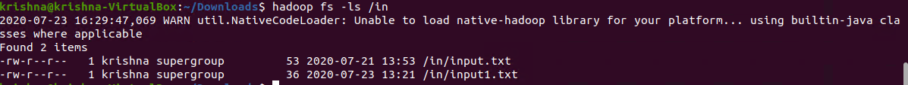
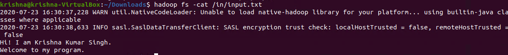
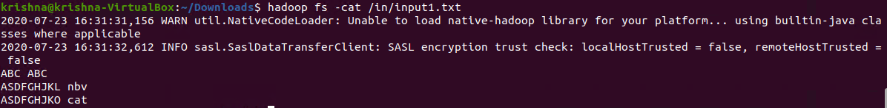
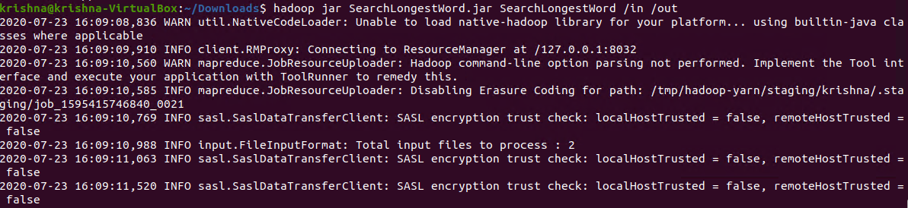
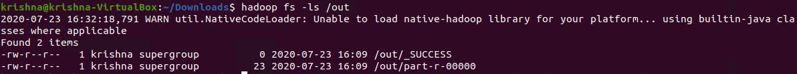
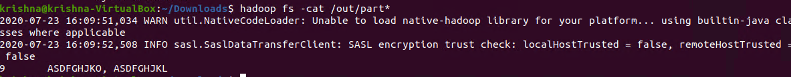
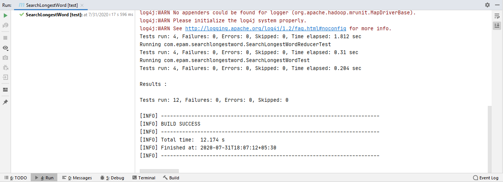

# Mapreduce Search Longest Word
-----------------------

## MapReduce

* Data processing layer in Hadoop. 
* Processing structured & Unstructured Data in Hadoop.

## Pros

* Best Performance 

## Cons 

* Hard to Extend 
* Lack of management tools
* Not suitable for real time processing
* very small community

## Input Directory

Input directory contains input files that will be processed by MapReduce to find longest word.

  

In the above screenshot, we can see an input directory (in) contains 2 input files (input.txt, input1.txt).

## Input.txt
 
  

In the above screenshot, we can see the content of the first input file.

## Input1.txt

  
 
In the above screenshot, we can see the content of the second input file.

## Executing Hadoop Jar

  
 
In the above screenshot, we can see the command to find longest word.  
<b>hadoop jar:</b> This is command used to execute Hadoop jar  
<b>SearchLongestWord.jar:</b> Hadoop jar file name  
<b>SearchLongestWord:</b> jar class name contains main().  
<b>/in:</b> Input directory contains file to process  
<b>/out:</b> Ouput directory will be created after execution of this command  

## Output Directory

Output directory will be automatically created contains output files.
 
  

## Read output file Content:

  
 
In the above screenshot, we can see the output contains key 9 – represent the length of the word & value – maximum length word.

## Test Cases:

  
 
In the above screenshot, we can see that all 12 test cases have passed.

**Created by:**  
**Name: Krishna Kumar Singh**  
**Email: krishnaai265@gmail.com**  
**Phone: +91-9368754996** 
